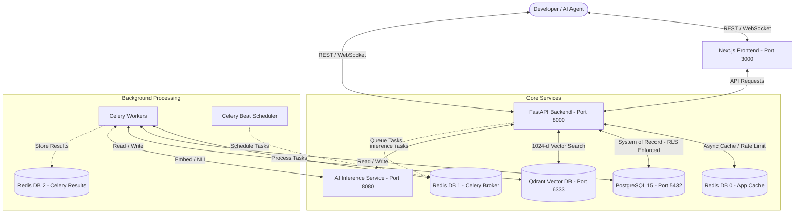

# 🌌 AtlasOS — AI Memory Operating System 

[](LICENSE)
[](https://www.python.org/downloads/)
[](https://fastapi.tiangolo.com/)
[](https://nextjs.org/)
[](https://www.docker.com/)

**AtlasOS** is a production-grade, multi-tenant AI Memory Operating System designed to provide hierarchical, contextual memory management for AI agents. It orchestrates working, episodic, and semantic memories with built-in natural language contradiction detection, background summarization, validation, and database-level audit logging.


## 🚀 Key Features

*   **Hierarchical Memory Engine**:
    *   **Working Memory**: Ephemeral, short-term task contexts powered by Redis with automatic TTLs.
    *   **Episodic Memory**: Raw historical experiences and chronological agent interactions stored securely in PostgreSQL with high-dimensional vector embeddings.
    *   **Semantic Memory**: Consolidated factual assertions synthesized through background summarization pipelines or explicit writes.
*   **Multi-Tenant Isolation**: Enforces tenant boundary isolation using PostgreSQL **Row-Level Security (RLS)** at the database layer and scoped filtering in the **Qdrant Vector Database**.
*   **Active Contradiction Detection**: Automatically evaluates incoming facts against existing semantic memories using an integrated NLI (Natural Language Inference) model (`roberta-large-mnli`) and resolves conflicts using custom policies (e.g., *most recent wins*, *confidence-weighted*, *manual review*).
*   **Immutable Audit Logging**: Prevents logs tampering using native database-level triggers that raise exceptions on any `UPDATE` or `DELETE` operations.
*   **Developer Console**: Next.js dashboard featuring API key rotation, interactive memory explorers, real-time logging, and evaluation analytics.


## 🏛️ System Architecture



---

## 🛠️ Technology Stack

*   **Backend**: FastAPI (Python 3.11+), SQLAlchemy 2.0 (asyncpg / psycopg2)
*   **Frontend**: Next.js 14, Tailwind CSS, TypeScript
*   **Task Queue**: Celery & Celery Beat
*   **Databases**:
    *   **PostgreSQL 15** (Relational storage and RLS)
    *   **Redis 7** (Caching, session state, Celery broker, working memory)
    *   **Qdrant 1.8.4** (Vector database for episodic & semantic embedding queries)
*   **Inference / NLI Models**: Self-hosted HuggingFace endpoints (default: `BAAI/bge-large-en-v1.5` and `roberta-large-mnli`)

---

## 🚦 Quick Start Guide

### Prerequisites
*   [Docker & Docker Compose](https://www.docker.com/products/docker-desktop/)
*   [Git](https://git-scm.com/)

### 1. Clone & Configure Environment
Clone the repository and copy the environment template:
```bash
git clone https://github.com/kartik-012/AtlasOS.git
cd AtlasOS
cp .env.example .env
```

> [!IMPORTANT]
> Make sure to open the `.env` file and generate secrets (`SECRET_KEY`, `JWT_SECRET_KEY`) or fill in any provider-specific API keys if you plan to use OpenAI or Gemini.

### 2. Build and Launch
Orchestrate all services with Docker Compose:
```bash
docker-compose up -d --build
```
This automatically boots:
*   PostgreSQL, Redis, Qdrant, and the AI Inference Service.
*   FastAPI backend, Celery workers, and Celery Beat scheduler.
*   Next.js Developer Console.

### 3. Initialize Databases
Apply database migrations and initialize Qdrant vector collections:
```bash
# Run Alembic migrations
docker-compose exec backend alembic upgrade head

# Initialize Qdrant collection schemas
docker-compose exec backend python scripts/init_qdrant.py
```

---

## 🌐 Endpoints & Dashboards

*   **Developer Console (Next.js)**: [http://localhost:3000](http://localhost:3000)
*   **Interactive API Documentation (Swagger)**: [http://localhost:8000/docs](http://localhost:8000/docs)
*   **Alternative API Docs (ReDoc)**: [http://localhost:8000/redoc](http://localhost:8000/redoc)
*   **Qdrant Vector DB Console**: [http://localhost:6333/dashboard](http://localhost:6333/dashboard)

---

## 🧹 Common Operations & Maintenance

*   **View Service Logs**:
    ```bash
    docker-compose logs -f backend
    docker-compose logs -f celery_worker
    ```
*   **Restart Services**:
    ```bash
    docker-compose restart backend frontend
    ```
*   **Teardown and Clean Volumes**:
    ```bash
    docker-compose down -v
    ```

---

## 📝 License
Distributed under the MIT License. See [LICENSE](LICENSE) for more details.
